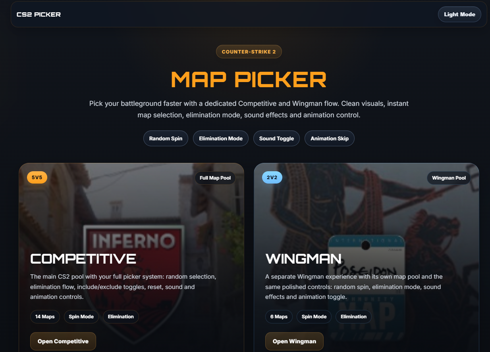
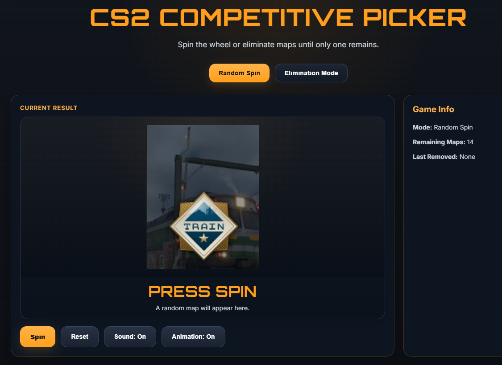
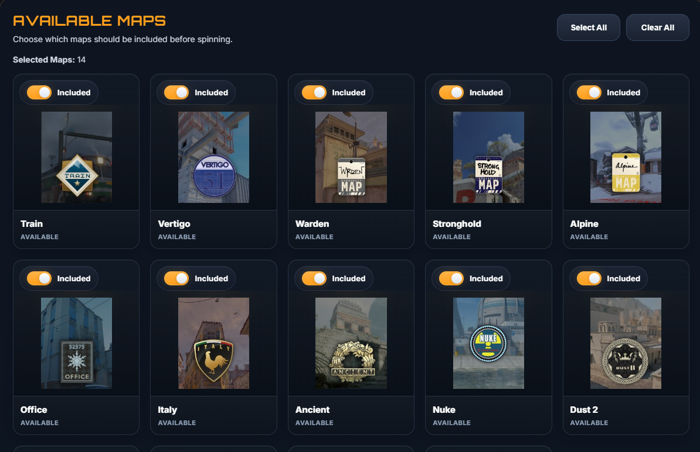

# 🎮 CS2 Map Picker

A simple and interactive **CS2 Map Picker** built with **HTML, CSS, and JavaScript**.

This tool helps players randomly select maps for different CS2 modes while giving extra control over the selection process with features like **map exclusions, elimination mode, animations, sound effects, and theme switching**.

---

# ✨ Features

✔ Random map picker  
✔ Competitive mode  
✔ Wingman mode  
✔ Map include / exclude toggle  
✔ Select all maps  
✔ Clear all maps  
✔ Elimination mode  
✔ Sound toggle  
✔ Animation toggle  
✔ Dark / Light theme

---

# 🖥 Pages

### 🏠 Home Page

Allows users to choose which mode they want to use.

### 🎯 Competitive Mode

Users can:

- randomly spin a competitive map
- include or exclude maps
- enable or disable animations
- enable or disable sounds
- select all maps
- clear all maps
- use elimination mode

### ⚔ Wingman Mode

Works the same as competitive mode but with **wingman maps**.

---

# 📂 Project Structure

.
├── index.html
├── competitive.html
├── wingman.html
├── style.css
├── theme.js
├── competitive.js
├── wingman.js
├── images/
└── sounds/

---

# 🛠 Technologies Used

- HTML5
- CSS3
- JavaScript

---

# 🚀 How to Run

Simply open:

index.html

in your browser.

For development it is recommended to use **Live Server** in **VS Code**.

---

# 📸 Screenshots

## 👨‍💻 Author

Created by **Tchokhura**

⭐ If you like this project, feel free to star the repository.
